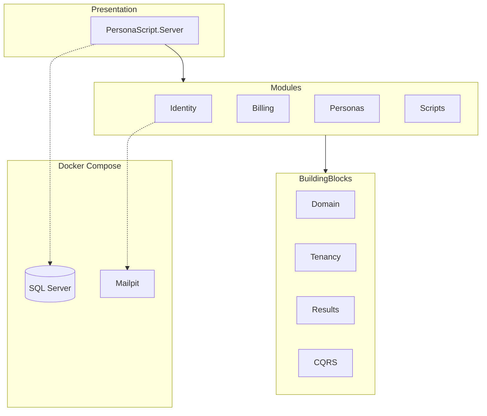
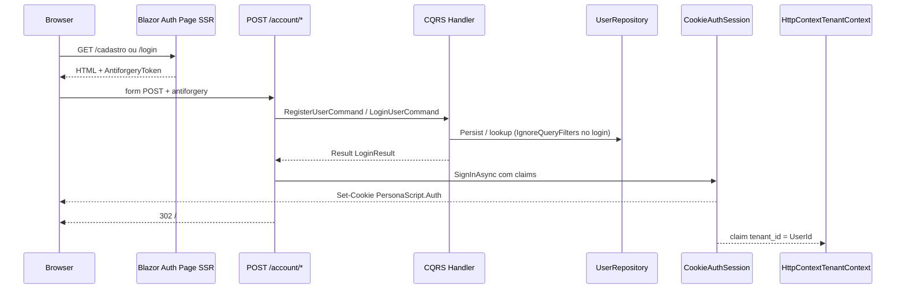

# Arquitetura — PersonaScript AI

Documentação viva do **PersonaScript AI**. Atualize este arquivo quando alterar contratos estruturais.

## Visão geral

- **Modelo:** SaaS B2C self-service (1 usuário = 1 tenant lógico)
- **Estilo:** Monolito modular (.NET 10)
- **Isolamento de dados:** Lógico via `TenantId` + Global Query Filters (EF Core)
- **UI:** Blazor Interactive Server; referência visual no [Stitch](https://stitch.withgoogle.com/projects/15459532074568969182)

## Autenticação B2C (Identity)

### Rotas

| Rota | Tipo | Função |
|------|------|--------|
| `/cadastro` | Página SSR | Formulário de registro (POST → `/account/register`) |
| `/login` | Página SSR | Formulário de login (POST → `/account/login`) |
| `POST /account/register` | Endpoint | Registra usuário, envia e-mail de boas-vindas via Resend, emite cookie, redirect `/` |
| `POST /account/login` | Endpoint | Autentica, emite cookie, redirect `/` ou `/login?error=...` |
| `/esqueci-senha` | Página SSR | Solicitação de link de redefinição de senha (POST → `/account/esqueci-senha`) |
| `POST /account/esqueci-senha` | Endpoint | Gera token e dispara e-mail de reset via Resend |
| `/redefinir-senha` | Página SSR | Formulário para digitação da nova senha (POST → `/account/redefinir-senha`) |
| `POST /account/redefinir-senha` | Endpoint | Valida token e atualiza a senha no banco de dados |
| `/logout` | Endpoint GET | Encerra cookie e redireciona para `/login` |

Design Stitch exportado em [`docs/design/stitch/`](design/stitch/README.md). Servidor de e-mails transacionais utilizando a API REST do **Resend** (com fallback para `FakeEmailSender` em ambiente de testes).

### Fluxo

As páginas auth são **SSR com form HTML** (sem `@rendermode InteractiveServer`). O `SignInAsync` ocorre nos endpoints HTTP **antes** do redirect — evita o erro *Headers are read-only* do circuito Blazor SignalR.

### Decisões

- **Cookie authentication** no Host; emissão de cookie apenas em endpoints HTTP (`POST /account/*`), não no circuito Blazor.
- **Handlers CQRS** fazem persistência/validação e retornam `LoginResult`; **não** chamam `IAuthSession`.
- Claim `tenant_id` = `UserId` (B2C 1:1); consumida por `HttpContextTenantContext`.
- Entidade `User` em schema `identity.Users`; `TenantId = Id` na criação.
- Hash de senha via `PasswordHasher<User>` (ASP.NET Identity Core).
- Login por e-mail usa `IgnoreQueryFilters()` (pré-tenant).
- Google/Apple: apenas UI desabilitada nesta entrega.
- Reset de e-mail completo: próxima entrega (Mailpit já disponível).

### Commands

| Command | Retorno | Regras principais |
|---------|---------|-------------------|
| `RegisterUserCommand` | `Result<LoginResult>` | Termos obrigatórios, senha ≥ 8, e-mail único; sign-in no endpoint |
| `LoginUserCommand` | `Result<LoginResult>` | Mensagem genérica se credenciais inválidas; sign-in no endpoint |

### Sistema de Roles (RBAC) e Políticas do Backoffice

- **UserRole (Domain Enum):**
  - `Subscriber` (Default para novos cadastros B2C)
  - `SupportAgent` (Atendimento ao cliente e suporte operacional)
  - `FinanceAdmin` (Gestão financeira e assinaturas)
  - `SystemAdmin` (Administração total do sistema)
- **Claims de Autorização:** `ClaimTypes.Role` e `"role"` incluídas no cookie `PersonaScript.Auth` e nos tokens JWT.
- **Políticas registradas no DI:**
  - `RequireSystemAdmin` (Exige `SystemAdmin`)
  - `RequireSupportAgent` (Exige `SupportAgent` ou `SystemAdmin`)
  - `RequireFinanceAdmin` (Exige `FinanceAdmin` ou `SystemAdmin`)
  - `RequireBackofficeAccess` (Exige `SupportAgent`, `FinanceAdmin` ou `SystemAdmin`)
- **Rotas & Telas:** `/backoffice` (dashboard operacional Blazor), `/acesso-negado` (403 Forbidden).

### Módulo Anamnese (Engine de Coleta em 10 Etapas)

- **Domain (`PersonaScript.Modules.Anamnese.Domain`):**
  - Entidade Aggregate Root `Anamnese` (`BaseEntity`, `IMustHaveTenant`).
  - 10 Value Objects fortemente tipados: `Etapa1QuemEVoce`, `Etapa2SuaHistoria`, `Etapa3SeuTrabalho`, `Etapa4SeuPaciente`, `Etapa5SuasReferencias`, `Etapa6LimitesExposicao`, `Etapa7SeuConhecimento`, `Etapa8SeuJeito`, `Etapa9RotinaCapacidade`, `Etapa10Objetivos`.
  - Invariants: Controle de progresso `PercentualConclusao` (0 a 100%), transição de status `Rascunho` → `Concluido`, bloqueio de mutações após conclusão, validação via `Result` / `Result<T>`.
- **Infrastructure (`PersonaScript.Modules.Anamnese.Infrastructure`):**
  - Schema EF Core `"anamnese"`, tabela `anamnese.Anamneses`.
  - Mapeamento de colunas JSON nativo SQL Server (`OwnsOne(..., b => b.ToJson())`).
  - Repositório `AnamneseRepository` e filtro global `ApplyTenantQueryFilters`.

## Mapa de projetos

| Projeto | Responsabilidade |
|---------|------------------|
| `PersonaScript.BuildingBlocks.Results` | `Result`, `Result<T>`, `Error` |
| `PersonaScript.BuildingBlocks.Domain` | `BaseEntity` (com `DomainEvents`), `ValueObject`, `IMustHaveTenant` (`SetTenantId`), `IDomainEvent`, `IAggregateRoot` |
| `PersonaScript.BuildingBlocks.Tenancy` | `TenantId`, `ITenantContext`, `HttpContextTenantContext` (claims: `tenant_id`, `NameIdentifier`, `sub`), `TenantDbContextInterceptor`, `ApplyTenantQueryFilters` |
| `PersonaScript.BuildingBlocks.CQRS` | Interfaces Command/Query/Handler |
| `PersonaScript.BuildingBlocks.AI` | Abstração `ILLMProvider`, retries e fallbacks via Polly, Structured Output JSON parsing (`ILLMJsonParser`), suporte a OpenAI/Gemini/Anthropic/Mock |
| `PersonaScript.Modules.Identity.*` | User, UserRole, auth commands, DbContext, cookie session, JWT generator, Resend email sender |
| `PersonaScript.Modules.Anamnese.*` | Anamnese Aggregate Root, 10 Value Objects, AnamneseDbContext (schema `anamnese`), AnamneseRepository |
| `PersonaScript.Modules.*.Domain` | Entidades e contratos do módulo |
| `PersonaScript.Modules.*.Application` | Commands, Queries, Handlers |
| `PersonaScript.Modules.*.Infrastructure` | EF Core, repositórios, `ModuleSetup` |
| `PersonaScript.Server` | Host Blazor, páginas auth, `/backoffice`, endpoints de conta e API |

## Multi-tenancy (isolamento lógico)

- Banco e schema **compartilhados**; discriminação por coluna `TenantId`.
- `TenantId` em B2C equivale ao `UserId` autenticado.
- `HttpContextTenantContext` lê prioritariamente a claim `tenant_id` do cookie/JWT com fallbacks para `ClaimTypes.NameIdentifier` e `sub` (retorna `Guid.Empty` se anônimo ou inválido).
- `TenantDbContextInterceptor` atribui automaticamente o `TenantId` no EF Core (`EntityState.Added`), impede gravações sob contextos anônimos e bloqueia alterações no `TenantId` em entidades modificadas (`EntityState.Modified`).
- Commands/Queries **nunca** recebem `TenantId` do cliente.
- Entidades de negócio implementam `IMustHaveTenant`.

## Docker Compose

Arquivo: [`docker-compose.yml`](../docker-compose.yml)

| Serviço | Imagem | Função |
|---------|--------|--------|
| `sqlserver` | `mcr.microsoft.com/mssql/server:2022-latest` | Persistência |
| `mailpit` | `axllent/mailpit` | E-mail de desenvolvimento |

Variáveis: [`.env.example`](../.env.example) → copiar para `.env`.

## Estado atual

Implementado:

- Subfase 1.1 concluída: BuildingBlocks + Tenancy B2C totalmente consolidados com `TenantDbContextInterceptor`, eventos de domínio (`IDomainEvent`), resiliência de claims e testes TDD.
- Subfase 1.2 concluída: Expansão do módulo Identity com fluxo de esqueci/redefinir senha, envio de e-mails via Resend/FakeEmailSender e páginas SSR.
- Subfase 1.3 concluída: Autenticação OAuth2 (Google/Apple) e emissão/validação de tokens JWT Bearer.
- Subfase 1.4 concluída: Sistema de Roles (RBAC), claims de role em cookie e JWT, políticas de autorização no container de DI, dashboard Blazor do Backoffice Operacional (`/backoffice`), página `/acesso-negado`.
- Subfase 2.1 concluída: Modelagem do módulo `Modules.Anamnese`, entidade Aggregate Root `Anamnese`, os 10 Value Objects do formulário digital em JSON Columns (EF Core schema `anamnese`), `AnamneseRepository`, injeção de dependência e testes unitários/isolamento de tenant.
- Subfase 2.2 concluída: Camada de Aplicação (CQRS) com `StartAnamneseCommand`, `SaveAnamneseStepCommand`, `CompleteAnamneseCommand`, `GetAnamneseStatusQuery`, `GetAnamneseStepQuery` e `GetFullAnamneseQuery`.
- Subfase 2.3 concluída: Interface Blazor Interativa (`AnamneseWizard.razor`), subcomponentes das 10 etapas (`Step1Component.razor` até `Step10Component.razor`), barra de progresso visual, ranker, tooltip didático e testes bUnit.
- Subfase 2.4 concluída: Motor de Acompanhamento Automático por IA (`IAnamneseClarificationService` / `HeuristicClarificationAnalyzer`), query CQRS `AnalyzeStepClarificationQuery`, modal Blazor Stitch UI `AnamneseAIClarificationModal.razor` e testes automatizados TDD.
- Subfase 3.1 concluída: Abstração de Integração com Provedores LLM (`PersonaScript.BuildingBlocks.AI`), interface `ILLMProvider`, resiliência e fallback automático de provedores com Polly, parsing e validação de schema JSON (`ILLMJsonParser`) e suíte de testes unitários TDD.
- Subfase 3.2 concluída: Motor de Prompt do Agente 1 (Estrategista de Persona), entidade `PersonaDiagnosis` (schema EF Core `personas`), Value Objects `IdentidadeMarca`, `PilarConteudo` (validação de 100% de distribuição) e `MatrizRestricoes`, `PersonaPromptBuilder`, `PersonaDiagnosisGenerator`, CQRS command/query (`GeneratePersonaDiagnosisCommand`, `GetPersonaDiagnosisQuery`) e 150 testes automatizados verdes na solução.

Próxima entrega:

- Subfase 3.3: Interface de Exibição e Ajuste do Diagnóstico de Posicionamento (`/posicionamento` e `/posicionamento/diagnostico`).

## Referências

- [AGENTS.md](../AGENTS.md) — diretrizes para desenvolvimento
- [README.md](../README.md) — como executar localmente
- [docs/design/stitch/README.md](design/stitch/README.md) — assets Cadastro/Login
