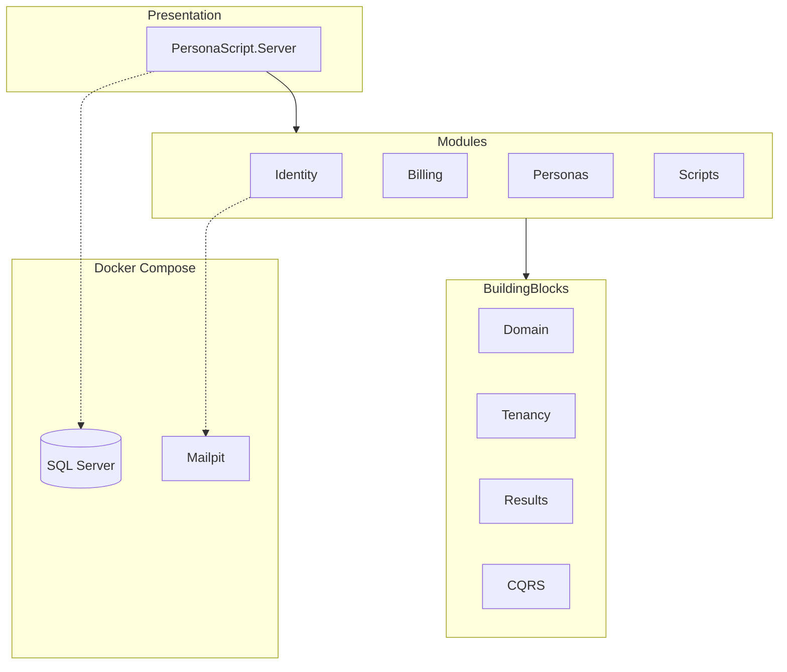
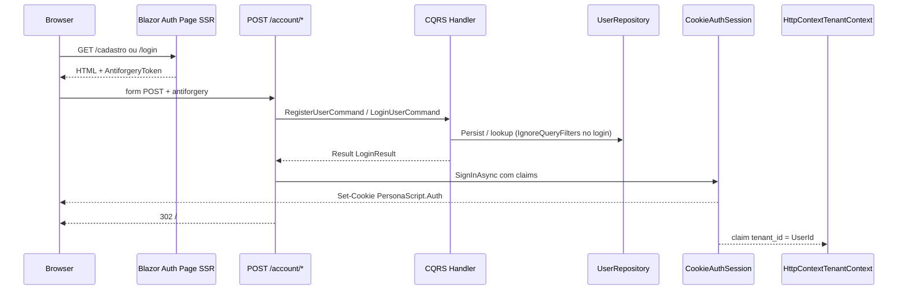

# Arquitetura — PersonaScript AI

Documentação viva do **PersonaScript AI**. Atualize este arquivo quando alterar contratos estruturais.

## Visão geral

- **Modelo:** SaaS B2C self-service (1 usuário = 1 tenant lógico)
- **Estilo:** Monolito modular (.NET 10)
- **Isolamento de dados:** Lógico via `TenantId` + Global Query Filters (EF Core)
- **UI:** Blazor Interactive Server; referência visual no [Stitch](https://stitch.withgoogle.com/projects/15459532074568969182)

## Autenticação B2C (Identity)

### Rotas

| Rota | Tipo | Função |
|------|------|--------|
| `/cadastro` | Página SSR | Formulário de registro (POST → `/account/register`) |
| `/login` | Página SSR | Formulário de login (POST → `/account/login`) |
| `POST /account/register` | Endpoint | Registra usuário, emite cookie, redirect `/` ou `/cadastro?error=...` |
| `POST /account/login` | Endpoint | Autentica, emite cookie, redirect `/` ou `/login?error=...` |
| `/esqueci-senha` | Página | Placeholder para reset via e-mail |
| `/logout` | Endpoint GET | Encerra cookie e redireciona para `/login` |

Design Stitch exportado em [`docs/design/stitch/`](design/stitch/README.md).

### Fluxo

As páginas auth são **SSR com form HTML** (sem `@rendermode InteractiveServer`). O `SignInAsync` ocorre nos endpoints HTTP **antes** do redirect — evita o erro *Headers are read-only* do circuito Blazor SignalR.

### Decisões

- **Cookie authentication** no Host; emissão de cookie apenas em endpoints HTTP (`POST /account/*`), não no circuito Blazor.
- **Handlers CQRS** fazem persistência/validação e retornam `LoginResult`; **não** chamam `IAuthSession`.
- Claim `tenant_id` = `UserId` (B2C 1:1); consumida por `HttpContextTenantContext`.
- Entidade `User` em schema `identity.Users`; `TenantId = Id` na criação.
- Hash de senha via `PasswordHasher<User>` (ASP.NET Identity Core).
- Login por e-mail usa `IgnoreQueryFilters()` (pré-tenant).
- Google/Apple: apenas UI desabilitada nesta entrega.
- Reset de e-mail completo: próxima entrega (Mailpit já disponível).

### Commands

| Command | Retorno | Regras principais |
|---------|---------|-------------------|
| `RegisterUserCommand` | `Result<LoginResult>` | Termos obrigatórios, senha ≥ 8, e-mail único; sign-in no endpoint |
| `LoginUserCommand` | `Result<LoginResult>` | Mensagem genérica se credenciais inválidas; sign-in no endpoint |

## Mapa de projetos

| Projeto | Responsabilidade |
|---------|------------------|
| `PersonaScript.BuildingBlocks.Results` | `Result`, `Result<T>`, `Error` |
| `PersonaScript.BuildingBlocks.Domain` | `BaseEntity`, `ValueObject`, `IMustHaveTenant`, `IAggregateRoot` |
| `PersonaScript.BuildingBlocks.Tenancy` | `TenantId`, `ITenantContext`, `HttpContextTenantContext`, filtros EF |
| `PersonaScript.BuildingBlocks.CQRS` | Interfaces Command/Query/Handler |
| `PersonaScript.Modules.Identity.*` | User, auth commands, DbContext, cookie session |
| `PersonaScript.Modules.*.Domain` | Entidades e contratos do módulo |
| `PersonaScript.Modules.*.Application` | Commands, Queries, Handlers |
| `PersonaScript.Modules.*.Infrastructure` | EF Core, repositórios, `ModuleSetup` |
| `PersonaScript.Server` | Host Blazor, páginas auth, `/health` |

## Multi-tenancy (isolamento lógico)

- Banco e schema **compartilhados**; discriminação por coluna `TenantId`.
- `TenantId` em B2C equivale ao `UserId` autenticado.
- `HttpContextTenantContext` lê claim `tenant_id` do cookie (fallback `Guid.Empty` se anônimo).
- Commands/Queries **nunca** recebem `TenantId` do cliente.
- Entidades de negócio implementam `IMustHaveTenant`.

## Docker Compose

Arquivo: [`docker-compose.yml`](../docker-compose.yml)

| Serviço | Imagem | Função |
|---------|--------|--------|
| `sqlserver` | `mcr.microsoft.com/mssql/server:2022-latest` | Persistência |
| `mailpit` | `axllent/mailpit` | E-mail de desenvolvimento |

Variáveis: [`.env.example`](../.env.example) → copiar para `.env`.

## Estado atual

Implementado:

- BuildingBlocks + testes TDD
- Identity: cadastro, login, cookie auth via `POST /account/*`, migration `InitialIdentity`
- UI `/cadastro` e `/login` alinhadas ao Stitch (SSR form post, dark card, social UI stub)
- `HttpContextTenantContext` + claim `tenant_id`
- Testes: domínio, handlers, repositório InMemory, bUnit das páginas auth, integração dos endpoints de conta

Próximas entregas:

- OAuth Google/Apple
- Reset de senha via Mailpit
- JWT bearer para APIs externas
- Billing (Stripe), Personas, Scripts

## Referências

- [AGENTS.md](../AGENTS.md) — diretrizes para desenvolvimento
- [README.md](../README.md) — como executar localmente
- [docs/design/stitch/README.md](design/stitch/README.md) — assets Cadastro/Login
