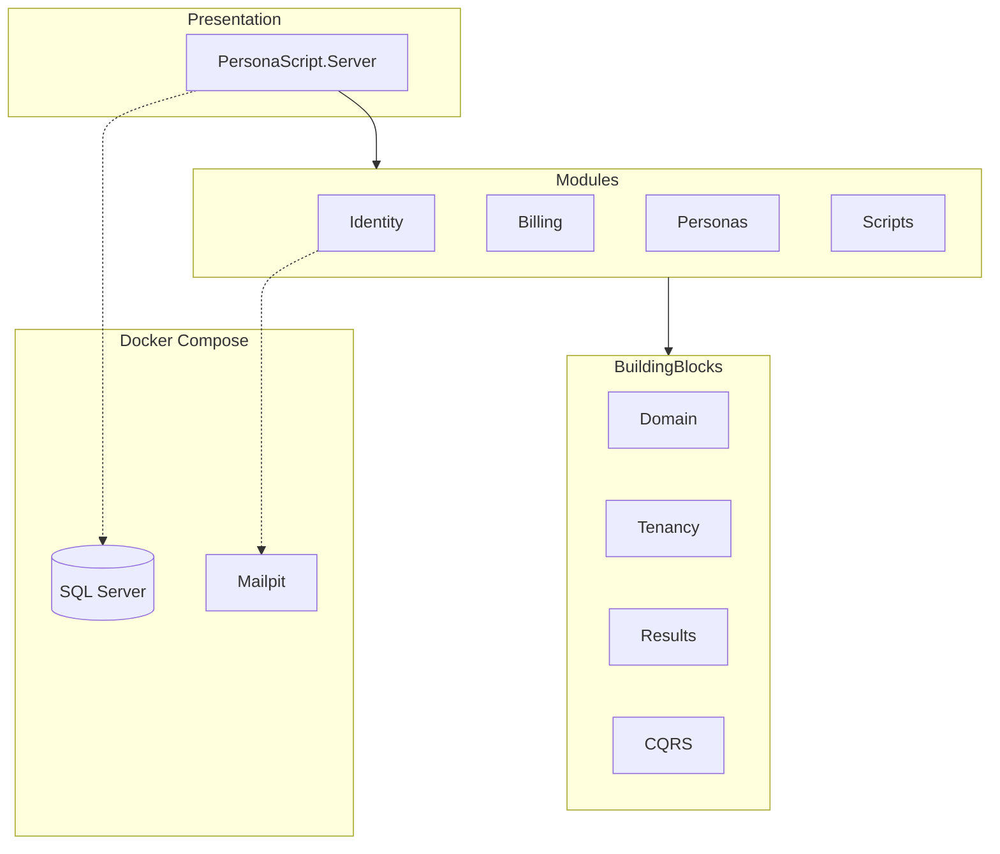

# Arquitetura — Fundação

Documentação viva da fundação do **PersonaScript AI**. Atualize este arquivo quando alterar contratos estruturais.

## Visão geral

- **Modelo:** SaaS B2C self-service (1 usuário = 1 tenant lógico)
- **Estilo:** Monolito modular (.NET 10)
- **Isolamento de dados:** Lógico via `TenantId` + Global Query Filters (EF Core)
- **UI:** Blazor Interactive Server; referência visual no [Stitch](https://stitch.withgoogle.com/projects/15459532074568969182)

## Mapa de projetos

| Projeto | Responsabilidade |
|---------|------------------|
| `PersonaScript.BuildingBlocks.Results` | `Result`, `Result<T>`, `Error` |
| `PersonaScript.BuildingBlocks.Domain` | `BaseEntity`, `ValueObject`, `IMustHaveTenant`, `IAggregateRoot` |
| `PersonaScript.BuildingBlocks.Tenancy` | `TenantId`, `ITenantContext`, filtros EF, `AddTenancy()` |
| `PersonaScript.BuildingBlocks.CQRS` | Interfaces Command/Query/Handler |
| `PersonaScript.Modules.*.Domain` | Entidades e contratos do módulo |
| `PersonaScript.Modules.*.Application` | Commands, Queries, Handlers |
| `PersonaScript.Modules.*.Infrastructure` | EF Core, repositórios, `ModuleSetup` |
| `PersonaScript.Server` | Host Blazor + endpoints mínimos |

## Multi-tenancy (isolamento lógico)

- Banco e schema **compartilhados**; discriminação por coluna `TenantId`.
- `TenantId` em B2C equivale ao `UserId` autenticado.
- `ITenantContext` resolve o tenant a partir da autenticação (stub `NullTenantContext` até o módulo Identity).
- Commands/Queries **nunca** recebem `TenantId` do cliente.
- Entidades de negócio implementam `IMustHaveTenant`.

## Docker Compose

Arquivo: [`docker-compose.yml`](../docker-compose.yml)

| Serviço | Imagem | Função |
|---------|--------|--------|
| `sqlserver` | `mcr.microsoft.com/mssql/server:2022-latest` | Persistência |
| `mailpit` | `axllent/mailpit` | E-mail de desenvolvimento |

Variáveis: [`.env.example`](../.env.example) → copiar para `.env`.

## Estado atual da fundação

Implementado:

- Solution .NET 10 com BuildingBlocks testados (TDD)
- Shells dos módulos Identity, Billing, Personas, Scripts
- Host Blazor com `/health`
- Compose SQL Server + Mailpit

Fora de escopo nesta fase:

- Migrations e entidades de negócio
- Autenticação JWT e claims de tenant
- Integração Stripe (Billing)
- Telas de produto (Stitch)

## Referências

- [AGENTS.md](../AGENTS.md) — diretrizes para desenvolvimento
- [README.md](../README.md) — como executar localmente
