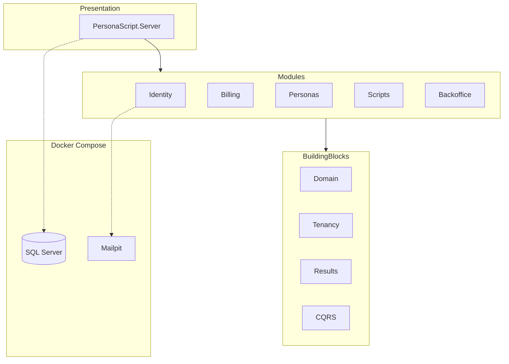
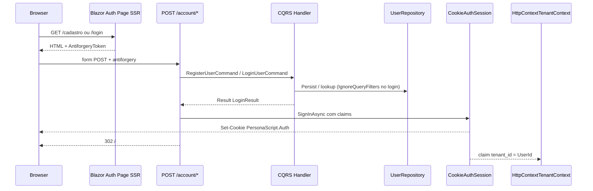

# Arquitetura — PersonaScript AI

Documentação viva do **PersonaScript AI**. Atualize este arquivo quando alterar contratos estruturais.

## Visão geral

- **Modelo:** SaaS B2C self-service (1 usuário = 1 tenant lógico)
- **Estilo:** Monolito modular (.NET 10)
- **Isolamento de dados:** Lógico via `TenantId` + Global Query Filters (EF Core)
- **UI:** Blazor Interactive Server; referência visual no [Stitch](https://stitch.withgoogle.com/projects/15459532074568969182)

```mermaid
flowchart TB
  subgraph presentation [Presentation]
    Server[PersonaScript.Server]
  end
  subgraph modules [Modules]
    Identity
    Billing
    Personas
    Scripts
    Backoffice
  end
  subgraph blocks [BuildingBlocks]
    Domain
    Tenancy
    Results
    CQRS
  end
  subgraph infra [Docker Compose]
    SQL[(SQL Server)]
    Mail[Mailpit]
  end
  Server --> modules
  modules --> blocks
  Server -.-> SQL
  Identity -.-> Mail
```

## Static web assets / Blazor script (.NET 10)

O host Blazor ([PersonaScript.Server](src/Presentation/PersonaScript.Server)) serve assets estáticos via `MapStaticAssets()` em [Program.cs](src/Presentation/PersonaScript.Server/Program.cs). O script do runtime (`_framework/blazor.web.js`) **não** fica em `wwwroot/` no código-fonte — é um static web asset do SDK (`Microsoft.AspNetCore.App.Internal.Assets`), referenciado em [App.razor](src/Presentation/PersonaScript.Server/Components/App.razor) com `@Assets["_framework/blazor.web.js"]`.

| Ambiente | Resolução do asset |
|----------|-------------------|
| Development | `StaticWebAssetsLoader` (automático) mapeia `_framework/*` para o SDK/NuGet |
| Testing / Production (Debug local) | `builder.WebHost.UseStaticWebAssets()` quando `!IsDevelopment()` — lê `*.staticwebassets.runtime.json` do build |
| Publish / Docker | Arquivos físicos em `wwwroot/_framework/` gerados pelo `dotnet publish`; `RequiresAspNetWebAssets=true` no `.csproj` garante inclusão |

**`.env`:** carregado com `Env.NoClobber().TraversePath().Load()` para não sobrescrever `ASPNETCORE_ENVIRONMENT` já definido pelo `launchSettings.json` ou pelo container. Não copie `.env.production.example` para `.env` em desenvolvimento local.

Referência: [aspnetcore#65468](https://github.com/dotnet/aspnetcore/issues/65468).

## Autenticação B2C (Identity)

### Rotas

| Rota | Tipo | Função |
|------|------|--------|
| `/cadastro` | Página SSR | Formulário de registro (POST → `/account/register`) |
| `/login` | Página SSR | Formulário de login (POST → `/account/login`) |
| `POST /account/register` | Endpoint | Registra usuário, envia e-mail de boas-vindas via Resend, emite cookie, redirect `/` |
| `POST /account/login` | Endpoint | Autentica, emite cookie, redirect `/` ou `/login?error=...` |
| `/esqueci-senha` | Página SSR | Solicitação de link de redefinição de senha (POST → `/account/esqueci-senha`) |
| `POST /account/esqueci-senha` | Endpoint | Gera token e dispara e-mail de reset via Resend |
| `/redefinir-senha` | Página SSR | Formulário para digitação da nova senha (POST → `/account/redefinir-senha`) |
| `POST /account/redefinir-senha` | Endpoint | Valida token e atualiza a senha no banco de dados |
| `/logout` | Endpoint GET | Encerra cookie e redireciona para `/login` |

Design Stitch exportado em [`docs/design/stitch/`](design/stitch/README.md). Servidor de e-mails transacionais utilizando a API REST do **Resend** (com fallback para `FakeEmailSender` em ambiente de testes).

### Fluxo

As páginas auth são **SSR com form HTML** (sem `@rendermode InteractiveServer`). O `SignInAsync` ocorre nos endpoints HTTP **antes** do redirect — evita o erro *Headers are read-only* do circuito Blazor SignalR.

```mermaid
sequenceDiagram
  participant Browser
  participant Page as Blazor Auth Page SSR
  participant Endpoint as POST /account/*
  participant Handler as CQRS Handler
  participant Repo as UserRepository
  participant Cookie as CookieAuthSession
  participant Tenant as HttpContextTenantContext

  Browser->>Page: GET /cadastro ou /login
  Page-->>Browser: HTML + AntiforgeryToken
  Browser->>Endpoint: form POST + antiforgery
  Endpoint->>Handler: RegisterUserCommand / LoginUserCommand
  Handler->>Repo: Persist / lookup (IgnoreQueryFilters no login)
  Handler-->>Endpoint: Result LoginResult
  Endpoint->>Cookie: SignInAsync com claims
  Cookie-->>Browser: Set-Cookie PersonaScript.Auth
  Endpoint-->>Browser: 302 /
  Cookie-->>Tenant: claim tenant_id = UserId
```

### Decisões

- **Cookie authentication** no Host; emissão de cookie apenas em endpoints HTTP (`POST /account/*`), não no circuito Blazor.
- **Handlers CQRS** fazem persistência/validação e retornam `LoginResult`; **não** chamam `IAuthSession`.
- Claim `tenant_id` = `UserId` (B2C 1:1); consumida por `HttpContextTenantContext`.
- Entidade `User` em schema `identity.Users`; `TenantId = Id` na criação.
- Hash de senha via `PasswordHasher<User>` (ASP.NET Identity Core).
- Login por e-mail usa `IgnoreQueryFilters()` (pré-tenant).
- Google/Apple: apenas UI desabilitada nesta entrega.
- Reset de e-mail completo: próxima entrega (Mailpit já disponível).

### Commands

| Command | Retorno | Regras principais |
|---------|---------|-------------------|
| `RegisterUserCommand` | `Result<LoginResult>` | Termos obrigatórios, senha ≥ 8, e-mail único; sign-in no endpoint |
| `LoginUserCommand` | `Result<LoginResult>` | Mensagem genérica se credenciais inválidas; sign-in no endpoint |

### Sistema de Roles (RBAC) e Políticas do Backoffice

- **UserRole (Domain Enum):**
  - `Subscriber` (Default para novos cadastros B2C)
  - `SupportAgent` (Atendimento ao cliente e suporte operacional)
  - `FinanceAdmin` (Gestão financeira e assinaturas)
  - `SystemAdmin` (Administração total do sistema)
- **Claims de Autorização:** `ClaimTypes.Role` e `"role"` incluídas no cookie `PersonaScript.Auth` e nos tokens JWT.
- **Políticas registradas no DI:**
  - `RequireSystemAdmin` (Exige `SystemAdmin`)
  - `RequireSupportAgent` (Exige `SupportAgent` ou `SystemAdmin`)
  - `RequireFinanceAdmin` (Exige `FinanceAdmin` ou `SystemAdmin`)
  - `RequireBackofficeAccess` (Exige `SupportAgent`, `FinanceAdmin` ou `SystemAdmin`)
- **Rotas & Telas:** `/backoffice` (dashboard operacional Blazor), `/acesso-negado` (403 Forbidden).

### Módulo Anamnese (Engine de Coleta em 10 Etapas)

- **Domain (`PersonaScript.Modules.Anamnese.Domain`):**
  - Entidade Aggregate Root `Anamnese` (`BaseEntity`, `IMustHaveTenant`).
  - 10 Value Objects fortemente tipados: `Etapa1QuemEVoce`, `Etapa2SuaHistoria`, `Etapa3SeuTrabalho`, `Etapa4SeuPaciente`, `Etapa5SuasReferencias`, `Etapa6LimitesExposicao`, `Etapa7SeuConhecimento`, `Etapa8SeuJeito`, `Etapa9RotinaCapacidade`, `Etapa10Objetivos`.
  - Invariants: Controle de progresso `PercentualConclusao` (0 a 100%), transição de status `Rascunho` → `Concluido`, bloqueio de mutações após conclusão, validação via `Result` / `Result<T>`.
- **Infrastructure (`PersonaScript.Modules.Anamnese.Infrastructure`):**
  - Schema EF Core `"anamnese"`, tabela `anamnese.Anamneses`.
  - Mapeamento de colunas JSON nativo SQL Server (`OwnsOne(..., b => b.ToJson())`).
  - Repositório `AnamneseRepository` e filtro global `ApplyTenantQueryFilters`.
- **UI / Frontend Blazor (`PersonaScript.Server.Components.Anamnese`):**
  - Formulários e etapas (`Step1` a `Step10`) e componentes de links utilizam estritamente o evento `@onchange` para campos de texto/área de texto (`input`/`textarea`), evitando `@oninput` com vinculação de `value` ao servidor via SignalR, prevenindo sobrescrita de digitação, perda de foco e caracteres invertidos.

## Mapa de projetos

| Projeto | Responsabilidade |
|---------|------------------|
| `PersonaScript.BuildingBlocks.Results` | `Result`, `Result<T>`, `Error` |
| `PersonaScript.BuildingBlocks.Domain` | `BaseEntity` (com `DomainEvents`), `ValueObject`, `IMustHaveTenant` (`SetTenantId`), `IDomainEvent`, `IAggregateRoot` |
| `PersonaScript.BuildingBlocks.Tenancy` | `TenantId`, `ITenantContext`, `HttpContextTenantContext` (claims: `tenant_id`, `NameIdentifier`, `sub`), `TenantDbContextInterceptor`, `ApplyTenantQueryFilters` |
| `PersonaScript.BuildingBlocks.CQRS` | Interfaces Command/Query/Handler |
| `PersonaScript.BuildingBlocks.AI` | Abstração `ILLMProvider`, retries e fallbacks via Polly, Structured Output JSON parsing (`ILLMJsonParser`), suporte a OpenAI/Gemini/Anthropic/Mock |
| `PersonaScript.Modules.Identity.*` | User, UserRole, auth commands, DbContext, cookie session, JWT generator, Resend email sender |
| `PersonaScript.Modules.Anamnese.*` | Anamnese Aggregate Root, 10 Value Objects, AnamneseDbContext (schema `anamnese`), AnamneseRepository |
| `PersonaScript.Modules.*.Domain` | Entidades e contratos do módulo |
| `PersonaScript.Modules.*.Application` | Commands, Queries, Handlers |
| `PersonaScript.Modules.*.Infrastructure` | EF Core, repositórios, `ModuleSetup` |
| `PersonaScript.Server` | Host Blazor, páginas auth, `/backoffice`, endpoints de conta e API |

## Multi-tenancy (isolamento lógico)

- Banco e schema **compartilhados**; discriminação por coluna `TenantId`.
- `TenantId` em B2C equivale ao `UserId` autenticado.
- `HttpContextTenantContext` lê prioritariamente a claim `tenant_id` do cookie/JWT com fallbacks para `ClaimTypes.NameIdentifier` e `sub` (retorna `Guid.Empty` se anônimo ou inválido).
- `TenantDbContextInterceptor` atribui automaticamente o `TenantId` no EF Core (`EntityState.Added`), impede gravações sob contextos anônimos e bloqueia alterações no `TenantId` em entidades modificadas (`EntityState.Modified`).
- Commands/Queries **nunca** recebem `TenantId` do cliente.
- Entidades de negócio implementam `IMustHaveTenant`.

## Docker Compose

### Desenvolvimento
Arquivo: [`docker-compose.yml`](../docker-compose.yml)

| Serviço | Imagem | Função |
|---------|--------|--------|
| `sqlserver` | `mcr.microsoft.com/mssql/server:2022-latest` | Persistência |
| `mailpit` | `axllent/mailpit` | E-mail de desenvolvimento |

Variáveis: [`.env.example`](../.env.example) → copiar para `.env`.

### Produção / Demonstração
Arquivo: [`docker-compose.prod.yml`](../docker-compose.prod.yml) e [`Dockerfile`](../Dockerfile)

| Serviço | Imagem / Build | Função |
|---------|----------------|--------|
| `web` | `./Dockerfile` (.NET 10) | Host Blazor Server e APIs (porta 8080) |
| `sqlserver` | `mcr.microsoft.com/mssql/server:2022-latest` | Banco de dados SQL Server com healthcheck |
| `mailpit` | `axllent/mailpit` | Servidor SMTP demo (UI na porta 8025) |

Variáveis: [`.env.production.example`](../.env.production.example) → copiar para `.env.production`.

## Estado atual

Implementado:

- Subfase 1.1 concluída: BuildingBlocks + Tenancy B2C totalmente consolidados com `TenantDbContextInterceptor`, eventos de domínio (`IDomainEvent`), resiliência de claims e testes TDD.
- Subfase 1.2 concluída: Expansão do módulo Identity com fluxo de esqueci/redefinir senha, envio de e-mails via Resend/FakeEmailSender e páginas SSR.
- Subfase 1.3 concluída: Autenticação OAuth2 (Google/Apple) e emissão/validação de tokens JWT Bearer.
- Subfase 1.4 concluída: Sistema de Roles (RBAC), claims de role em cookie e JWT, políticas de autorização no container de DI, dashboard Blazor do Backoffice Operacional (`/backoffice`), página `/acesso-negado`.
- Subfase 2.1 concluída: Modelagem do módulo `Modules.Anamnese`, entidade Aggregate Root `Anamnese`, os 10 Value Objects do formulário digital em JSON Columns (EF Core schema `anamnese`), `AnamneseRepository`, injeção de dependência e testes unitários/isolamento de tenant.
- Subfase 2.2 concluída: Camada de Aplicação (CQRS) com `StartAnamneseCommand`, `SaveAnamneseStepCommand`, `CompleteAnamneseCommand`, `GetAnamneseStatusQuery`, `GetAnamneseStepQuery` e `GetFullAnamneseQuery`.
- Subfase 2.3 concluída: Interface Blazor Interativa (`AnamneseWizard.razor`), subcomponentes das 10 etapas (`Step1Component.razor` até `Step10Component.razor`), barra de progresso visual, ranker, tooltip didático e testes bUnit.
- Subfase 2.4 concluída: Motor de Acompanhamento Automático por IA (`IAnamneseClarificationService` / `HeuristicClarificationAnalyzer`), query CQRS `AnalyzeStepClarificationQuery`, modal Blazor Stitch UI `AnamneseAIClarificationModal.razor` e testes automatizados TDD.
- Subfase 3.1 concluída: Abstração de Integração com Provedores LLM (`PersonaScript.BuildingBlocks.AI`), interface `ILLMProvider`, resiliência e fallback automático de provedores com Polly, parsing e validação de schema JSON (`ILLMJsonParser`) e suíte de testes unitários TDD.
- Subfase 5.1 concluída: Modelagem do Módulo Billing e Assinaturas (entidades Plan, Subscription, UsageQuota, QuotaTransaction com isolamento de tenant).
- Subfase 5.2 concluída: Integração com Gateway de Pagamento Stripe Checkout & Webhooks idempotentes (`POST /webhooks/stripe`).
- Subfase 5.3 concluída: Validação de Quotas e Interceptadores de Limite de Uso com `QuotaValidationCommandHandlerDecorator` para Commands CQRS protegidos, background job automático `MonthlyQuotaResetBackgroundService` para renovação mensal de franquias e modal Blazor Stitch UI `QuotaExceededModal.razor`.

- Subfase 6.1 concluída: Backoffice Operacional Administrativo, autorização RBAC obrigatória (`RequireBackofficeAccess`, `RequireSystemAdmin`), layout base responsivo `AdminLayout.razor` sob a rota `/admin/...`.
- Subfase 6.2 concluída: Gestão de Tenants/Usuários, Anamnese consolidada, Impersonação auditada de Suporte com justificativa obrigatória e log `AdminImpersonationLog`.
- Subfase 6.3 concluída: Gestão Financeira B2C, métricas MRR/ARR, ajuste de limites de planos e sobrescrita de quota por tenant com log `OVERRIDE_TENANT_QUOTA`.
- Subfase 6.4 concluída: Gestão Dinâmica de Prompts de IA, tabela versionada `PromptTemplates`, editor com playground em tempo real para LLM, rollback instantâneo de versão de prompt com 1 clique e logs de auditoria `CREATE_PROMPT_VERSION` e `ROLLBACK_PROMPT_VERSION`.
- Subfase 7.1 concluída: Suíte de Testes de Isolamento Multi-Tenant (Anti Cross-Tenant Leak) cobrindo 100% dos repositórios, queries e commands em todos os módulos (Anamnese, Personas, Scripts, Billing, Identity, Backoffice) e endpoints HTTP E2E (`MultiTenantHttpCrossTenantIntegrationTests`), totalizando 339 testes com 100% de sucesso.
- Subfase 7.2 concluída: Testes de Interface Blazor (bUnit) e Integração E2E com cobertura completa de UI (Anamnese Wizard e componentes auxiliares, Diagnóstico de Posicionamento e modais de edição/regeneração, Gerador de Roteiros e modais de exportação/refinamento, Backoffice Operacional com Dashboard, Tenants, Auditoria, Ética e Telemetria) e teste de aceitação de jornada completa de ponta a ponta (`FullUserJourneyAcceptanceTests` cobrindo Registro -> Assinatura/Quotas -> Anamnese 10 Etapas -> Diagnóstico de Persona -> Roteiro de Vídeo -> Consumo de Franquia -> Barreira Multi-Tenant), elevando o total da suíte para 382 testes automatizados com 100% de sucesso.
- Subfase 7.3 concluída: Otimização de Consultas SQL Server, Caching e Performance:
  - Convenção automática `EnsureTenantIndexes` no BuildingBlock Tenancy para todas as entidades `IMustHaveTenant`.
  - Índices explícitos e compostos de alta seletividade nos módulos `Identity`, `Anamnese`, `Personas`, `Scripts`, `Billing` e `Backoffice`.
  - `ValueComparer` explícito para coleções JSON de `AnamneseDbContext`, eliminando alertas de tracking do EF Core.
  - Caching Decorator em memória (`IMemoryCache`) para `IPromptTemplateRepository`, `ICouncilRuleRepository` e `IForbiddenTermRepository` com invalidação cirúrgica por Commands CQRS.
  - Middleware `PerformanceTimingMiddleware` com cabeçalhos `Server-Timing` e monitoramento de SLA (< 500ms).
  - Total de testes da solução elevado de 382 para 400 testes com 100% de aprovação (`dotnet test`).
- Subfase 7.4 concluída: Hardening de Segurança, Sanitização de Prompts e OWASP Compliance:
  - Serviço `IPromptSanitizer` / `PromptSanitizer` no BuildingBlock de IA com defesa contra injeções adversariais (OWASP LLM01), remoção de delimitadores de sistema (`<system>`, `[INST]`, `<|im_start|>`), isolamento de contexto (`<untrusted_user_content>`) e System Prompt Hardening nos agentes (`PersonaPromptBuilder`, `VideoScriptPromptBuilder`).
  - Validação estrita e rejeição de ataques com `Result.Failure(DomainErrors.Prompt.InjectionDetected)` em handlers CQRS (`GenerateVideoScriptCommandHandler`, `GeneratePersonaDiagnosisCommandHandler`, `TestPromptPlaygroundCommandHandler`).
  - Rate Limiting nativo do ASP.NET Core com políticas `auth-policy`, `ai-generation-policy` e `webhooks-policy`, emitindo HTTP 429 Too Many Requests com `Retry-After`.
  - `SecurityHeadersMiddleware` injetando cabeçalhos de segurança OWASP (`Content-Security-Policy`, `X-Frame-Options: DENY`, `X-Content-Type-Options: nosniff`, `Referrer-Policy`, `Permissions-Policy`, `Strict-Transport-Security`).
  - Hardening de cookies com `HttpOnly`, `SameSite = Lax` e `SecurePolicy`.
  - Total de testes da solução elevado de 400 para **431 testes com 100% de aprovação (`dotnet test`)**.

- Subfase 8.1 concluída: Pipeline de CI/CD e Infraestrutura de Produção:
  - Workflows GitHub Actions modulares: `ci.yml` (linter `dotnet format`, build Release, 431 testes com cobertura e auditoria de vulnerabilidades de dependências) e `cd.yml` (build multi-stage Docker para GHCR, deploy Staging/Produção e smoke test em `/health`).
  - Containerização .NET 10 multi-stage com execução sob usuário não-root (`USER $APP_UID`) e inclusão de todos os 6 módulos no `Dockerfile`.
  - Orquestração com `docker-compose.prod.yml` com logging rotacionado (`json-file`, 50MB, 5 cópias), limites de recursos de CPU e memória, healthchecks e suporte a `APPLY_MIGRATIONS=true`.
  - Scripts operacionais [`scripts/deploy.sh`](../scripts/deploy.sh) (com health check ativo e rollback automático) e [`scripts/apply-migrations.sh`](../scripts/apply-migrations.sh) (gerador de SQL idempotente por DbContext).
  - Guia técnico completo documentado em [`docs/CI_CD_INFRASTRUCTURE.md`](CI_CD_INFRASTRUCTURE.md).

- Subfase 8.2 concluída: Logging Estruturado, Observabilidade e Alertas:
  - Logging estruturado com Serilog e enriquecimento contextual automático via `TenantLogContextMiddleware` (`TenantId`, `UserId`, `TraceId`, `Environment`, `ProcessId`, `ThreadId`).
  - Suporte a múltiplos sinks configuráveis: console legível para desenvolvimento, JSON estruturado para contêineres e Seq/OTLP via `appsettings.json`.
  - Health checks granulares do ASP.NET Core: `/health/live` (liveness probe leve), `/health/ready` (readiness probe avaliando os 6 DbContexts) e `/health` (diagnóstico JSON completo formatado com durações e metadados).
  - Serviço de alertas operacionais proativos (`IOperationalAlertService`, `SlackTeamsWebhookAlertService`) com formatação específica para Slack (Block Kit) e Microsoft Teams (MessageCards), disparando automaticamente em falhas de webhook do Stripe e rate limits/erros de autenticação de provedores de LLM.
  - Métricas e telemetria nativas do .NET 10 via `System.Diagnostics.Metrics.Meter` (`personscript.llm.requests`, `personscript.llm.failures`, `personscript.billing.webhook_failures`, `personscript.llm.duration.ms`).
  - Sincronização completa de Migrações e Índices de Performance (.NET 10 / EF Core): geração e consolidação das migrations pendentes da Subfase 7.3 em todos os 6 módulos (`Identity`, `Anamnese`, `Billing`, `Personas`, `Scripts`, `Backoffice`), eliminando `PendingModelChangesWarning` em tempo de inicialização e regenerando os scripts SQL idempotentes em `migrations-sql/`.
  - Testes de consistência de migrações (`DatabaseMigrationsConsistencyTests`) validando a paridade estrita entre o mapeamento C# e os `ModelSnapshot`s compilados.
  - Total de testes da solução elevado para **448 testes com 100% de aprovação (`dotnet test`)**.
  - Documentação viva completa em [`docs/OBSERVABILITY_AND_ALERTS.md`](OBSERVABILITY_AND_ALERTS.md).

- Subfase 8.3 concluída: Seed de Usuário Master (Backoffice) e SmartAuth:
  - Criação do seeder idempotente [`MasterAdminSeeder.cs`](../src/Modules/Identity/PersonaScript.Modules.Identity.Infrastructure/Seed/MasterAdminSeeder.cs) no módulo Identity, com credenciais configuradas via variáveis de ambiente (`MASTER_ADMIN_EMAIL`, `MASTER_ADMIN_PASSWORD`, `MASTER_ADMIN_NAME`) no `.env` e `.docker-compose.prod.yml`.
  - Atribuição automática do papel `SystemAdmin` e execução durante a inicialização/migrações (`SeedMasterAdminAsync`).
  - Implementação do esquema de autenticação inteligente `SmartAuth` (`AddPolicyScheme`), que roteia requisições com `Bearer` ou sob `/api` para `JwtBearer` e requisições Web normais para `CookieAuthentication`, corrigindo conflito que causava falsos 404 ao acessar rotas protegidas como `/admin`.
  - Suíte de testes automatizados expandida para **453 testes com 100% de aprovação**.

Próxima entrega:

- Subfase 8.4: Programa Beta Fechado com Profissionais de Saúde (20 a 50 profissionais, métricas de usabilidade e calibração de prompts no Backoffice).

## Referências

- [AGENTS.md](../AGENTS.md) — diretrizes para desenvolvimento
- [docs/CI_CD_INFRASTRUCTURE.md](CI_CD_INFRASTRUCTURE.md) — esteira de CI/CD e infraestrutura de produção
- [docs/OBSERVABILITY_AND_ALERTS.md](OBSERVABILITY_AND_ALERTS.md) — observabilidade, logging estruturado e alertas
- [README.md](../README.md) — como executar localmente
- [docs/design/stitch/README.md](design/stitch/README.md) — assets Cadastro/Login

